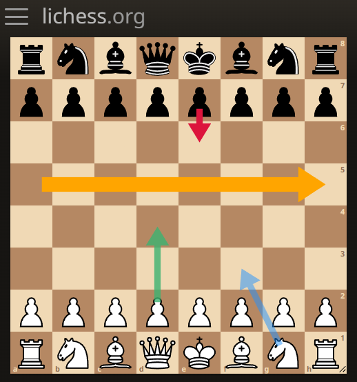
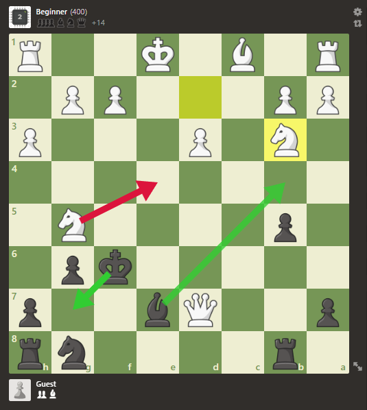

# UniversalBoardDrawer
A userscript library for seamlessly adding chess move arrows to game boards on popular platforms like Chess.com and Lichess.org.

<table>
  <tr>
    <td>
      
    </td>
    <td>
      
    </td>
  </tr>
</table>

## Installation

To use UniversalBoardDrawer in your userscript, you need to add the following line to the userscript header

```js
// @require     https://raw.githubusercontent.com/Hakorr/UniversalBoardDrawer/main/UniversalBoardDrawer.js
```

## Usage

### Constructor
```javascript
const BoardDrawer = new UniversalBoardDrawer(config);
```

The config object can consists of the following properties:

- `window` (Object): A variable representing the window object.
- `boardElem` (HTMLElement): The board element. Needs to be completely initialized and ready, otherwise UniversalBoardDrawer's container might disappear. For accurate results, ensure that the size and position of this element is as close to the visible board as possible.
- `parentElem` (HTMLElement, optional): The element where UniversalBoardDrawer's container will be appended. Defaults to `document.body`.
- `boardDimensions` (Array, optional): The dimensions of the board. Defaults to `[8, 8]`.
- `playerColor` (String, optional): The board orientation, either `'w'` or `'b'`. Defaults to `'w'`.
- `zIndex` (Number, optional): The z-index of the UniversalBoardDrawer container. If you don't see UniversalBoardDrawer, try raising this number. Defaults to `1000`.
- `terminateAfterDisappear` (Boolean, optional): Specifies whether UniversalBoardDrawer should terminate itself after the board element disappears (usually when the element is removed). Defaults to `true`.
- `debugMode` (Boolean, optional): Specifies whether the debug mode is enabled. Enable this to see console logs from UniversalBoardDrawer. Defaults to `false`.

### Methods

#### `createShape(shapeType, coordinates, config)`
This method creates a shape on the board with the specified configuration.

- `shapeType` (String): The type of shape to create. Currently, only `'arrow'` is supported.
- `coordinates` (Array): An array with two fen position strings representing the start and end positions.
- `config` (Object, optional): An object containing additional configuration options for the shape.

##### Arrow Configuration Options
- `lineWidth` (Number): The width of the arrow line.
- `arrowheadWidth` (Number): The width of the arrowhead.
- `arrowheadHeight` (Number): The height of the arrowhead.
- `startOffset` (Number): The offset of the arrow start position.
- `style` (String): Additional CSS style for the shape element.

##### Returns:
An HTMLElement representing the created shape.

#### `terminate()`
This method terminates the `UniversalBoardDrawer` instance by removing all elements and cleaning up resources.

## Example Usage (chess.com)

```javascript
// ==UserScript==
// @name        Example userscript
// @namespace   HKR
// @match       https://www.chess.com/play/computer
// @grant       none
// @version     1.0
// @author      HKR
// @description Example userscript
// @require     https://raw.githubusercontent.com/Hakorr/UniversalBoardDrawer/main/UniversalBoardDrawer.js
// @run-at      document-start
// ==/UserScript==

function load(boardElem) {
    const BoardDrawer = new UniversalBoardDrawer({
        'window': window,
        'boardElem': boardElem,
        'boardDimensions': [8, 8],
        'playerColor': 'w', // assuming you're playing as white
        'zIndex': 99999,
        'debugMode': true
    });

    const defaultArrowElem = BoardDrawer.createShape('arrow', ['f6', 'g7']); // create arrow from h1 to h6, with default config

    // create arrow from d2 to f6 with custom config
    const bigArrowElem = BoardDrawer.createShape('arrow', ['g5', 'e4'], {
        lineWidth: 25,
        arrowheadWidth: 75,
        arrowheadHeight: 55,
        startOffset: 25,
        style: `fill: crimson; opacity: 1;`
    });

    BoardDrawer.createShape('arrow', ['e7', 'b4'], {
        style: `fill: limegreen;`
    });

    setTimeout(() => bigArrowElem.remove(), 5000);

    setTimeout(() => BoardDrawer.terminate(), 10000);
}

const observer = new MutationObserver((mutationsList, observer) => {
    const boardElem = document.querySelector('#board-vs-personalities');

    if(boardElem) {
        observer.disconnect();

        load(boardElem);
    }
});

observer.observe(document, { childList: true, subtree: true });
```
